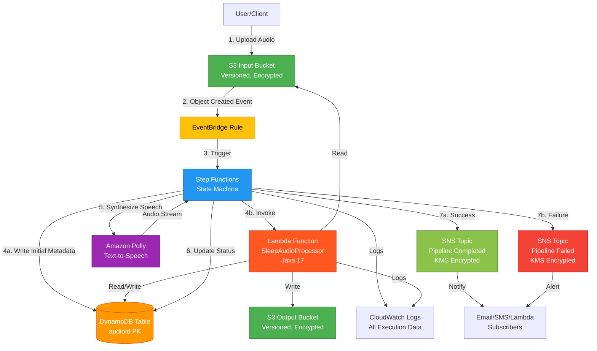

# Architecture Documentation

## System Overview

**cdk-sleep-java-qdev** is an event-driven, serverless sleep audio processing pipeline built with AWS CDK (Java). The system automatically processes audio files uploaded to S3, enriches metadata, synthesizes speech, and notifies downstream systems—all with zero server management and automatic scaling.

## Architecture Diagram



## Architecture Flow

### 1. File Upload (Entry Point)
- User uploads audio file to **S3 Input Bucket**
- Bucket has versioning and S3-managed encryption enabled
- EventBridge notifications are enabled on the bucket

### 2. Event Triggering
- S3 emits **Object Created** event to EventBridge
- **EventBridge Rule** filters for events from the input bucket
- Rule transforms the event and triggers Step Functions state machine

### 3. Workflow Orchestration (Step Functions)
The state machine orchestrates the following steps:

#### Step 3a: Write Initial Metadata
- **DynamoDB PutItem** task writes initial record
- Stores: `audioId`, `status: PROCESSING`, `inputBucket`, `inputKey`, `createdAt`
- Provides audit trail and enables status tracking

#### Step 3b: Lambda Processing
- **Lambda Invoke** task calls `SleepAudioProcessorFunction`
- Lambda receives S3 event details (bucket, key, audioId, eventTime)
- Current functionality:
  - Logs input for debugging
  - Performs basic validation
  - Returns success response with metadata
- Future enhancements:
  - Extract audio metadata (duration, format, bitrate)
  - Validate audio file format and quality
  - Enrich metadata with additional information
  - Update DynamoDB with enriched data
  - Perform audio transformations
- Error handling: Catches all errors and routes to failure path

#### Step 3c: Speech Synthesis
- **Polly SynthesizeSpeech** task generates audio
- Uses neural voice (Joanna) for high-quality output
- Currently uses placeholder text (to be replaced with dynamic content)
- Returns audio stream metadata
- Error handling: Catches all errors and routes to failure path

#### Step 3d: Status Update (Success Path)
- **DynamoDB UpdateItem** updates status to `COMPLETED`
- Adds `updatedAt` timestamp
- Preserves processing history

#### Step 3e: Success Notification
- **SNS Publish** sends completion notification
- Includes full execution context for downstream processing
- Encrypted with KMS

#### Step 3f: Status Update (Failure Path)
- **DynamoDB UpdateItem** updates status to `FAILED`
- Stores error information in `errorInfo` attribute
- Adds `updatedAt` timestamp

#### Step 3g: Failure Notification
- **SNS Publish** sends failure alert
- Includes error details for troubleshooting
- Encrypted with KMS

### 4. Monitoring and Observability
- **CloudWatch Logs** capture all execution data
- Step Functions logs all state transitions and data
- Lambda logs processing details
- Enables debugging, monitoring, and compliance

## Component Details

### S3 Input Bucket
**Purpose**: Receives raw audio files for processing

**Configuration**:
- S3-managed encryption (SSE-S3)
- Versioning enabled
- EventBridge notifications enabled
- Public access blocked (all 4 settings)
- Removal policy: DESTROY (dev environment)
- Auto-delete objects on stack deletion (dev)

**Security**:
- Block all public access
- Encryption at rest
- Version history for audit trail

### S3 Output Bucket
**Purpose**: Stores processed audio files

**Configuration**:
- S3-managed encryption (SSE-S3)
- Versioning enabled
- Public access blocked
- Removal policy: DESTROY (dev environment)
- Auto-delete objects on stack deletion (dev)

**Security**:
- Block all public access
- Encryption at rest
- Version history

### DynamoDB Table
**Purpose**: Stores audio pipeline metadata and status

**Schema**:
- **Partition Key**: `audioId` (String) - typically the S3 object key
- **Attributes** (sample):
  - `status`: PROCESSING | COMPLETED | FAILED
  - `inputBucket`: Source S3 bucket name
  - `inputKey`: Source S3 object key
  - `createdAt`: Pipeline start timestamp
  - `updatedAt`: Last update timestamp
  - `errorInfo`: Error details (if failed)

**Configuration**:
- Billing mode: PAY_PER_REQUEST (on-demand)
- Encryption: AWS-managed (SSE)
- Point-in-time recovery enabled
- Removal policy: DESTROY (dev environment)

**Security**:
- Encryption at rest with AWS-managed keys
- Least-privilege IAM policies
- Point-in-time recovery for data protection

### Lambda Function (SleepAudioProcessor)
**Purpose**: Process and enrich audio file metadata

**Configuration**:
- Runtime: Java 17
- Handler: `com.myorg.SleepAudioProcessor::handleRequest`
- Environment Variables:
  - `TABLE_NAME`: DynamoDB table name

**Current Functionality**:
- Receives input from Step Functions (S3 event details, audioId)
- Logs input for debugging and monitoring
- Performs basic validation (bucket and key presence)
- Returns success response with metadata

**Future Enhancements** (Placeholder for):
- Extract audio metadata (duration, format, bitrate, sample rate)
- Validate audio file format and quality
- Perform audio transformations (normalization, compression)
- Enrich metadata with additional information
- Update DynamoDB with enriched data
- Generate thumbnails or waveform visualizations

**Permissions**:
- Read/Write access to DynamoDB table
- Read access to S3 input bucket
- Write access to S3 output bucket
- CloudWatch Logs write access (automatic)

**Error Handling**:
- Catches all exceptions and logs error details
- Throws RuntimeException to trigger Step Functions error handling
- Step Functions routes to failure path on error

### EventBridge Rule
**Purpose**: Triggers pipeline when audio files are uploaded

**Event Pattern**:
```json
{
  "source": ["aws.s3"],
  "detail-type": ["Object Created"],
  "detail": {
    "bucket": {
      "name": ["<input-bucket-name>"]
    }
  }
}
```

**Target**: Step Functions state machine with transformed input

**Input Transformation**:
- Maps S3 event fields to state machine input
- Extracts: bucket name, object key, event time, event details

### Step Functions State Machine
**Purpose**: Orchestrates the audio processing workflow

**Type**: STANDARD (for long-running workflows and auditing)

**States**:
1. **WriteInitialMetadata** (DynamoDB PutItem)
2. **ProcessAudio** (Lambda Invoke) - NEW in Issue #7
3. **PollyTextToSpeech** (CallAwsService)
4. **UpdateStatusCompleted** (DynamoDB UpdateItem)
5. **PublishSuccessNotification** (SNS Publish)
6. **UpdateStatusFailed** (DynamoDB UpdateItem)
7. **PublishFailureNotification** (SNS Publish)
8. **PipelineSucceeded** (Succeed)
9. **PipelineFailed** (Fail)

**Error Handling**:
- Lambda task has Catch block for all errors (`States.ALL`)
- Polly task has Catch block for all errors (`States.ALL`)
- Error path: Update status to FAILED → Publish failure notification → End in failure state
- Error details stored in `$.errorMessage` for debugging

**Logging**:
- CloudWatch Logs integration
- Log level: ALL (includes execution data)
- Enables debugging and compliance

**Permissions**:
- DynamoDB: PutItem, UpdateItem (via grant methods)
- Polly: SynthesizeSpeech (via policy statement)
- SNS: Publish to both topics (via policy statement)
- Lambda: InvokeFunction (via LambdaInvoke construct)
- S3: Read from input bucket, write to output bucket (via grant methods)
- CloudWatch Logs: PutLogEvents (automatic)

### Amazon Polly
**Purpose**: Text-to-speech synthesis for sleep audio

**Configuration**:
- Voice: Joanna (neural engine)
- Output format: MP3
- Text: Currently placeholder (to be replaced with dynamic content)

**Future Enhancements**:
- Dynamic text from S3 objects or DynamoDB
- Multiple voice options
- SSML support for advanced speech control
- Audio processing (pitch, speed adjustments)

### SNS Topics
**Purpose**: Notify subscribers of pipeline events

**Topics**:
1. **SleepAudioPipelineCompleted**: Success notifications
2. **SleepAudioPipelineFailed**: Failure alerts

**Configuration**:
- KMS encryption enabled (customer-managed key)
- Key rotation enabled for security
- Display names for easy identification

**Security**:
- Encrypted at rest and in transit
- Automatic key rotation
- Least-privilege publish permissions

### CloudWatch Logs
**Purpose**: Centralized logging for observability

**Log Groups**:
- Step Functions execution logs
- Lambda function logs

**Configuration**:
- Removal policy: DESTROY (dev environment)
- Log level: ALL for Step Functions (includes execution data)

## Security Considerations

### Encryption
- **S3**: Server-side encryption (SSE-S3) on all buckets
- **DynamoDB**: AWS-managed encryption (SSE)
- **SNS**: KMS encryption with customer-managed key and automatic rotation
- **Data in transit**: HTTPS/TLS for all AWS service communication

### IAM Permissions (Least Privilege)
- **State Machine Role**:
  - DynamoDB: Read/write to metadata table only
  - Polly: SynthesizeSpeech only
  - SNS: Publish to specific topics only
  - Lambda: Invoke specific function only
  - S3: Read from input, write to output buckets only
  - CloudWatch Logs: Write logs

- **Lambda Execution Role**:
  - DynamoDB: Read/write to metadata table only
  - S3: Read from input bucket, write to output bucket only
  - CloudWatch Logs: Write logs

- **EventBridge Rule**:
  - Step Functions: StartExecution on specific state machine only

### Network Security
- All S3 buckets have public access blocked (4 settings)
- All services communicate over AWS internal network (no internet exposure)

### Data Protection
- S3 versioning enabled for data recovery
- DynamoDB point-in-time recovery enabled
- CloudWatch Logs for audit trail

## Future Enhancements

### Planned Features
1. **Complete Lambda Processing Logic** (Issue #8)
   - Audio metadata extraction
   - Format validation
   - Quality checks
   - Audio transformations

2. **Input Validation** (Issue #8)
   - File format validation
   - Size limits
   - Content type verification

3. **End-to-End Testing** (Issue #8)
   - Integration tests
   - Pipeline smoke tests
   - Performance benchmarks

4. **Advanced Audio Processing**
   - Noise reduction
   - Volume normalization
   - Format conversion
   - Compression optimization

5. **Enhanced Monitoring**
   - CloudWatch Dashboards
   - Custom metrics
   - Alarms and alerts
   - X-Ray tracing

6. **Production Readiness**
   - Environment-specific configurations
   - Resource tagging
   - Cost optimization
   - Backup strategies

7. **API Layer**
   - API Gateway for programmatic access
   - Authentication and authorization
   - Rate limiting
   - API documentation

## Technology Stack

- **Infrastructure as Code**: AWS CDK (Java)
- **Compute**: AWS Lambda (Java 17)
- **Orchestration**: AWS Step Functions
- **Storage**: Amazon S3
- **Database**: Amazon DynamoDB
- **AI/ML**: Amazon Polly
- **Messaging**: Amazon SNS
- **Event Management**: Amazon EventBridge
- **Monitoring**: Amazon CloudWatch
- **Security**: AWS KMS, AWS IAM
- **Build Tool**: Maven
- **Testing**: JUnit 5, CDK Assertions

## Development Workflow

See [CONTRIBUTING.md](CONTRIBUTING.md) for:
- Test-Driven Development (TDD) guidelines
- Coding standards
- Git workflow
- Pull request process

## Deployment

```bash
# Run tests
mvn clean test

# Synthesize CloudFormation
cdk synth

# Preview changes
cdk diff

# Deploy to AWS
cdk deploy
```

---

**Last Updated**: Issue #7 - Lambda Function Skeleton + Step Functions Integration  
**Maintained By**: Q Developer Agent  
**Version**: 0.1
