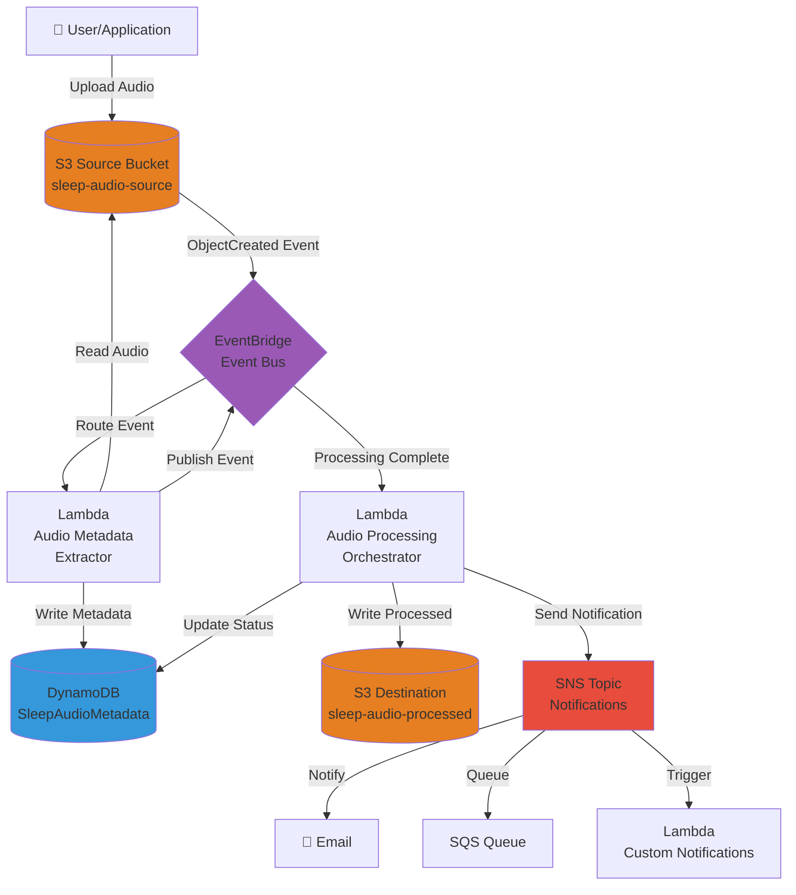

# Architecture Documentation

## Project Overview

The **cdk-sleep-java-qdev** project is an event-driven, serverless sleep audio processing pipeline built on AWS Cloud Development Kit (CDK) using Java. This architecture demonstrates a modern, scalable approach to audio file processing with automated event handling, storage management, metadata persistence, and notification capabilities.

## Architectural Philosophy

This project follows AWS Well-Architected Framework principles:
- **Operational Excellence**: Infrastructure as Code (IaC) with AWS CDK for repeatable deployments
- **Security**: Least privilege IAM policies, encryption at rest and in transit
- **Reliability**: Event-driven architecture with automatic retries and dead-letter queues
- **Performance Efficiency**: Serverless compute with Lambda, automatic scaling
- **Cost Optimization**: Pay-per-use serverless components, no idle resources
- **Sustainability**: Serverless architecture minimizes resource waste

## Event-Driven Sleep Audio Pipeline

### High-Level Flow

The pipeline is designed to process sleep audio files uploaded to Amazon S3 through a fully automated, event-driven workflow. The architecture consists of the following stages:

#### 1. **Ingestion Stage (S3 Source Bucket)**
- **Purpose**: Receives raw sleep audio files from users or external systems
- **Bucket Name Pattern**: `sleep-audio-source-{accountId}-{region}`
- **File Formats**: MP3, WAV, FLAC, M4A
- **Encryption**: S3 bucket encryption enabled with AWS KMS
- **Versioning**: Enabled to prevent accidental data loss
- **Event Notifications**: Configured to emit S3 ObjectCreated events to EventBridge

#### 2. **Event Bus (Amazon EventBridge)**
- **Purpose**: Decouples event producers from consumers, enables flexible routing
- **Event Pattern**: Captures S3 ObjectCreated events with filtering rules
- **Benefits**: 
  - Multiple consumers can subscribe to the same event
  - Easy to add new processing workflows without modifying existing code
  - Built-in retry and error handling capabilities
  - Event replay for debugging and reprocessing

#### 3. **Processing Stage (AWS Lambda Functions)**

**3a. Audio Metadata Extractor Lambda**
- **Trigger**: EventBridge rule matching S3 ObjectCreated events
- **Function**: 
  - Downloads audio file from source S3 bucket
  - Extracts metadata (duration, bitrate, sample rate, channels, format)
  - Generates unique audio ID
  - Validates file integrity and format
- **Runtime**: Java 17 with AWS SDK for Java v2
- **Memory**: 512 MB (configurable based on file sizes)
- **Timeout**: 5 minutes
- **Output**: Publishes custom event to EventBridge with metadata

**3b. Audio Transcoding Lambda (Future)**
- **Purpose**: Convert audio files to optimized formats for streaming
- **Triggers**: EventBridge event from metadata extractor
- **Technology**: FFmpeg Lambda Layer or AWS Elemental MediaConvert
- **Output Formats**: Multiple bitrate MP3 versions for adaptive streaming

**3c. Audio Analysis Lambda (Future)**
- **Purpose**: Analyze audio characteristics (volume levels, silence detection, frequency analysis)
- **Triggers**: EventBridge event from metadata extractor
- **Technology**: AWS Rekognition Audio or custom ML models
- **Use Cases**: Quality validation, automatic categorization

#### 4. **Storage Stage**

**4a. Processed Audio Storage (S3 Destination Bucket)**
- **Bucket Name Pattern**: `sleep-audio-processed-{accountId}-{region}`
- **Purpose**: Stores processed/transcoded audio files
- **Lifecycle Policies**: 
  - Transition to S3 Intelligent-Tiering after 30 days
  - Archive to Glacier after 90 days for cost optimization
- **CDN Integration**: CloudFront distribution for global delivery (future)

**4b. Metadata Persistence (Amazon DynamoDB)**
- **Table Name**: `SleepAudioMetadata`
- **Primary Key**: `audioId` (String, UUID format)
- **Attributes**:
  - `audioId`: Unique identifier for the audio file
  - `sourceKey`: Original S3 object key
  - `fileName`: Original file name
  - `uploadTimestamp`: ISO 8601 timestamp
  - `duration`: Duration in seconds
  - `format`: Audio format (mp3, wav, etc.)
  - `bitrate`: Bitrate in kbps
  - `sampleRate`: Sample rate in Hz
  - `channels`: Number of audio channels (1=mono, 2=stereo)
  - `fileSize`: File size in bytes
  - `processingStatus`: Status (uploaded, processing, completed, failed)
  - `processedKey`: S3 key for processed audio (if applicable)
  - `tags`: Map of user-defined tags
- **Secondary Indexes**:
  - GSI on `uploadTimestamp` for time-based queries
  - GSI on `processingStatus` for monitoring
- **Point-in-Time Recovery**: Enabled for data protection
- **On-Demand Billing**: Suitable for variable workload patterns

#### 5. **Notification Stage (Amazon SNS)**
- **Topic Name**: `SleepAudioProcessingNotifications`
- **Purpose**: Notify subscribers about processing completion or failures
- **Subscribers**:
  - Email notifications for administrators
  - SQS queue for downstream application integration
  - Lambda function for custom notification logic
- **Message Format**: JSON with audioId, status, metadata, and error details
- **Filtering**: SNS subscription filters for status-based routing

### Error Handling and Observability

- **Dead Letter Queues (DLQ)**: SQS DLQs attached to Lambda functions for failed event processing
- **CloudWatch Logs**: All Lambda functions log to CloudWatch with structured JSON logging
- **CloudWatch Alarms**: Alarms for Lambda errors, DLQ depth, and processing duration
- **X-Ray Tracing**: Distributed tracing enabled for end-to-end request tracking
- **Metrics**: Custom CloudWatch metrics for business KPIs (files processed, processing time, error rates)

## Architecture Diagram

