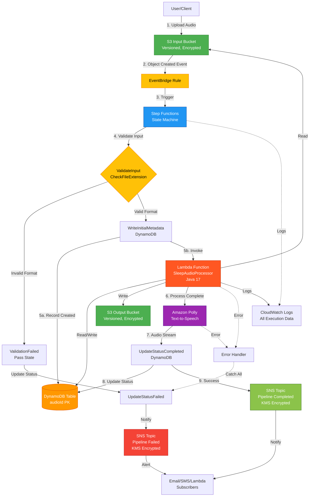
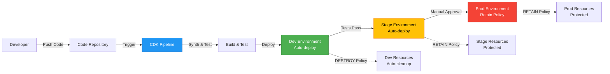

# Architecture Documentation

## System Overview

**cdk-sleep-java-qdev** is an event-driven, serverless sleep audio processing pipeline built with AWS CDK (Java). The system automatically processes audio files uploaded to S3, enriches metadata, synthesizes speech, and notifies downstream systems—all with zero server management and automatic scaling.

## Architecture Diagram



## Architecture Flow

## Deployment Architecture (NEW in Issue #9)



### Multi-Environment Strategy
- **Dev**: Rapid development, auto-cleanup (DESTROY policy)
- **Stage**: Pre-production testing, data retention (RETAIN policy)
- **Prod**: Production workloads, full data protection (RETAIN policy)

CDK Pipelines skeleton created for future automated deployment across environments.

### Complete End-to-End Pipeline with Input Validation
### 1. File Upload (Entry Point)
- User uploads audio file to **S3 Input Bucket**
- Bucket has versioning and S3-managed encryption enabled
- EventBridge notifications are enabled on the bucket

### 2. Event Triggering
- S3 emits **Object Created** event to EventBridge
- **EventBridge Rule** filters for events from the input bucket
- Rule transforms the event and triggers Step Functions state machine

### 3. Workflow Orchestration (Step Functions)
The state machine orchestrates the following steps:
The state machine orchestrates a complete pipeline with input validation and error handling:

#### Step 3.0: Input Validation (NEW in Issue #8)
- **ValidateInput** (Pass state) extracts and validates input fields
- Validates bucket name, object key, and event time are present
- Extracts file extension for format validation
- **CheckFileExtension** (Choice state) validates supported formats
  - Supported formats: `.mp3`, `.wav`, `.m4a`, `.flac`
  - Valid files proceed to processing pipeline
  - Invalid files route to error path
- **ValidationFailed** (Pass state) captures validation errors
  - Sets clear error message for unsupported formats
  - Routes to UpdateStatusFailed → SNS failure notification → End
#### Step 3a: Write Initial Metadata
#### Step 3.1: Write Initial Metadata
- Stores: `audioId`, `status: PROCESSING`, `inputBucket`, `inputKey`, `createdAt`
- Provides audit trail and enables status tracking

- Only executed after validation passes
#### Step 3b: Lambda Processing
#### Step 3.2: Lambda Processing with Validation
- Lambda receives S3 event details (bucket, key, audioId, eventTime)
- Current functionality:
- **Input Validation** (NEW in Issue #8):
  - Validates bucket and key are not empty
  - Checks file extension matches supported formats (`.mp3`, `.wav`, `.m4a`, `.flac`, `.ogg`)
  - Throws IllegalArgumentException for invalid inputs
  - Logs all validation steps
- Processing functionality:
  - Performs basic validation
  - Returns success response with metadata
- Future enhancements:
  - Extract audio metadata (duration, format, bitrate)
  - Validate audio file format and quality
  - Deep file content validation (magic bytes, codec validation)
  - Update DynamoDB with enriched data
  - Perform audio transformations
- Error handling: Catches all errors and routes to failure path

#### Step 3c: Speech Synthesis
#### Step 3.3: Speech Synthesis
- Uses neural voice (Joanna) for high-quality output
- Currently uses placeholder text (to be replaced with dynamic content)
- Returns audio stream metadata
- Error handling: Catches all errors and routes to failure path
#### Step 3.4: Status Update (Success Path)
#### Step 3d: Status Update (Success Path)
- **DynamoDB UpdateItem** updates status to `COMPLETED`
- Adds `updatedAt` timestamp
- Preserves processing history
#### Step 3.5: Success Notification
#### Step 3e: Success Notification
- **SNS Publish** sends completion notification
- Includes full execution context for downstream processing
- Triggers PipelineSucceeded state
- Encrypted with KMS
#### Step 3.6: Status Update (Failure Path)
#### Step 3f: Status Update (Failure Path)
- **DynamoDB UpdateItem** updates status to `FAILED`
- Stores error information in `errorInfo` attribute
- Handles both validation failures and processing errors
- Adds `updatedAt` timestamp
#### Step 3.7: Failure Notification
#### Step 3g: Failure Notification
- **SNS Publish** sends failure alert
- Includes error details for troubleshooting
- Triggers PipelineFailed state
- Encrypted with KMS

### 4. Monitoring and Observability
- **CloudWatch Logs** capture all execution data
- Step Functions logs all state transitions and data
- Lambda logs processing details
- Enables debugging, monitoring, and compliance

## Component Details

### S3 Input Bucket
**Purpose**: Receives raw audio files for processing

**Configuration**:
- S3-managed encryption (SSE-S3)
- Versioning enabled
- EventBridge notifications enabled
- Public access blocked (all 4 settings)
- Removal policy: DESTROY (dev environment)
- Auto-delete objects on stack deletion (dev)

**Security**:
- Block all public access
- Encryption at rest
- Version history for audit trail

### S3 Output Bucket
**Purpose**: Stores processed audio files

**Configuration**:
- S3-managed encryption (SSE-S3)
- Versioning enabled
- Public access blocked
- Removal policy: DESTROY (dev environment)
- Auto-delete objects on stack deletion (dev)

**Security**:
- Block all public access
- Encryption at rest
- Version history

### DynamoDB Table
**Purpose**: Stores audio pipeline metadata and status

**Schema**:
- **Partition Key**: `audioId` (String) - typically the S3 object key
- **Attributes** (sample):
  - `status`: PROCESSING | COMPLETED | FAILED
  - `inputBucket`: Source S3 bucket name
  - `inputKey`: Source S3 object key
  - `createdAt`: Pipeline start timestamp
  - `updatedAt`: Last update timestamp
  - `errorInfo`: Error details (if failed)

**Configuration**:
- Billing mode: PAY_PER_REQUEST (on-demand)
- Encryption: AWS-managed (SSE)
- Point-in-time recovery enabled
- Removal policy: DESTROY (dev environment)

**Security**:
- Encryption at rest with AWS-managed keys
- Least-privilege IAM policies

### Input Validation (NEW in Issue #8)
**Purpose**: Ensure only valid audio files enter the pipeline

**Validation Layers**:
1. **State Machine Level** (CheckFileExtension Choice state):
   - Pattern matching for file extensions
   - Supported formats: `.mp3`, `.wav`, `.m4a`, `.flac`
   - Routes invalid files to error path before processing

2. **Lambda Level** (SleepAudioProcessor):
   - Required field validation (bucket, key)
   - File extension validation (`.mp3`, `.wav`, `.m4a`, `.flac`, `.ogg`)
   - Detailed error logging
   - Throws exceptions for Step Functions error handling
- Point-in-time recovery for data protection

### Lambda Function (SleepAudioProcessor)
**Purpose**: Process and enrich audio file metadata

**Configuration**:
- Runtime: Java 17
- Handler: `com.myorg.SleepAudioProcessor::handleRequest`
- Environment Variables:
  - `TABLE_NAME`: DynamoDB table name

**Current Functionality** (Enhanced in Issue #8):
- Receives input from Step Functions (S3 event details, audioId)
- Logs input for debugging and monitoring
- **Input Validation**:
  - Validates required fields (bucket, key)
  - Validates file extension against supported formats
  - Logs validation steps
  - Throws exceptions for invalid inputs
- Performs metadata processing
- Returns success response with metadata

**Future Enhancements** (Placeholder for):
- Extract audio metadata (duration, format, bitrate, sample rate)
- Validate audio file format and quality
- Perform audio transformations (normalization, compression)
- Enrich metadata with additional information
- Update DynamoDB with enriched data
- Generate thumbnails or waveform visualizations

**Permissions**:
- Read/Write access to DynamoDB table
- Read access to S3 input bucket
- Write access to S3 output bucket
- CloudWatch Logs write access (automatic)

**Error Handling**:
- Catches all exceptions and logs error details
- Throws RuntimeException to trigger Step Functions error handling
- Step Functions routes to failure path on error

### EventBridge Rule
**Purpose**: Triggers pipeline when audio files are uploaded

**Event Pattern**:
```json
{
  "source": ["aws.s3"],
  "detail-type": ["Object Created"],
  "detail": {
    "bucket": {
      "name": ["<input-bucket-name>"]
    }
  }
}
```

**Target**: Step Functions state machine with transformed input

**Input Transformation**:
- Maps S3 event fields to state machine input
- Extracts: bucket name, object key, event time, event details

### Step Functions State Machine
**Purpose**: Orchestrates the audio processing workflow

**Type**: STANDARD (for long-running workflows and auditing)

0. **ValidateInput** (Pass) - NEW in Issue #8
0.5. **CheckFileExtension** (Choice) - NEW in Issue #8
0.6. **ValidationFailed** (Pass) - NEW in Issue #8
1. **WriteInitialMetadata** (DynamoDB PutItem) - Issue #5
2. **ProcessAudio** (Lambda Invoke) - Issue #7
3. **PollyTextToSpeech** (CallAwsService) - Issue #4
3. **PollyTextToSpeech** (CallAwsService)
4. **UpdateStatusCompleted** (DynamoDB UpdateItem)
5. **PublishSuccessNotification** (SNS Publish)
6. **UpdateStatusFailed** (DynamoDB UpdateItem)
7. **PublishFailureNotification** (SNS Publish)
8. **PipelineSucceeded** (Succeed)
9. **PipelineFailed** (Fail)
**Error Handling** (Enhanced in Issue #8):
- **Validation Errors**:
  - CheckFileExtension routes unsupported formats to error path
  - ValidationFailed state captures error details
  - No processing occurs for invalid files
- **Processing Errors**:
**Error Handling**:
- Lambda task has Catch block for all errors (`States.ALL`)
- Polly task has Catch block for all errors (`States.ALL`)
- Error path: Update status to FAILED → Publish failure notification → End in failure state
- Error details stored in `$.errorMessage` for debugging

**Logging**:
- CloudWatch Logs integration
- Log level: ALL (includes execution data)
- Enables debugging and compliance

**Permissions**:
- DynamoDB: PutItem, UpdateItem (via grant methods)
- Polly: SynthesizeSpeech (via policy statement)
- SNS: Publish to both topics (via policy statement)
- Lambda: InvokeFunction (via LambdaInvoke construct)
- S3: Read from input bucket, write to output bucket (via grant methods)
- CloudWatch Logs: PutLogEvents (automatic)

### Amazon Polly
**Purpose**: Text-to-speech synthesis for sleep audio

**Configuration**:
- Voice: Joanna (neural engine)
- Output format: MP3
- Text: Currently placeholder (to be replaced with dynamic content)

**Future Enhancements**:
- Dynamic text from S3 objects or DynamoDB
- Multiple voice options
- SSML support for advanced speech control
- Audio processing (pitch, speed adjustments)

### SNS Topics
**Purpose**: Notify subscribers of pipeline events

**Topics**:
1. **SleepAudioPipelineCompleted**: Success notifications
2. **SleepAudioPipelineFailed**: Failure alerts

**Configuration**:
- KMS encryption enabled (customer-managed key)
- Key rotation enabled for security
- Display names for easy identification

**Security**:
- Encrypted at rest and in transit
- Automatic key rotation
- Least-privilege publish permissions

### CloudWatch Logs
**Purpose**: Centralized logging for observability

**Log Groups**:
- Step Functions execution logs
- Lambda function logs

**Configuration**:
- Removal policy: DESTROY (dev environment)
- Log level: ALL for Step Functions (includes execution data)

## Security Considerations

### Encryption
- **S3**: Server-side encryption (SSE-S3) on all buckets
- **DynamoDB**: AWS-managed encryption (SSE)
- **SNS**: KMS encryption with customer-managed key and automatic rotation
- **Data in transit**: HTTPS/TLS for all AWS service communication

### IAM Permissions (Least Privilege)
- **State Machine Role**:
  - DynamoDB: Read/write to metadata table only
  - Polly: SynthesizeSpeech only
  - SNS: Publish to specific topics only
  - Lambda: Invoke specific function only
  - S3: Read from input, write to output buckets only
  - CloudWatch Logs: Write logs

- **Lambda Execution Role**:
  - DynamoDB: Read/write to metadata table only
  - S3: Read from input bucket, write to output bucket only
  - CloudWatch Logs: Write logs

- **EventBridge Rule**:
  - Step Functions: StartExecution on specific state machine only

### Network Security
- All S3 buckets have public access blocked (4 settings)
- All services communicate over AWS internal network (no internet exposure)

### Data Protection
- S3 versioning enabled for data recovery
- DynamoDB point-in-time recovery enabled
- CloudWatch Logs for audit trail

## Future Enhancements

### Planned Features
1. **Complete Lambda Processing Logic** (Issue #8)
   - ✅ Input validation with file extension checking
   - ✅ Complete pipeline wiring
   - Audio metadata extraction (planned)
   - Deep content validation (planned)

2. **Input Validation** (Issue #8)
   - ✅ File format validation (extension-based)
   - Size limits
   - Content type verification
3. **Deployment & Testing** (Issue #9)
   - ✅ Multi-environment support (dev, stage, prod)
   - ✅ CDK Pipelines skeleton
   - ✅ Environment-based resource policies
   - ✅ Comprehensive pipeline testing
   - CI/CD integration (in progress)
   - Performance benchmarks

4. **Advanced Audio Processing**
   - Noise reduction
   - Volume normalization
   - Format conversion
   - Compression optimization

5. **Enhanced Monitoring**
   - CloudWatch Dashboards
   - Custom metrics
   - Alarms and alerts
   - X-Ray tracing

6. **Production Readiness**
   - ✅ Environment-specific configurations
   - ✅ Resource tagging
   - Cost optimization
   - Backup strategies
   - Manual approval gates for prod deployments

7. **API Layer**
   - API Gateway for programmatic access
   - Authentication and authorization
   - Rate limiting
   - API documentation

## Technology Stack

- **Infrastructure as Code**: AWS CDK (Java)
- **Compute**: AWS Lambda (Java 17)
- **Orchestration**: AWS Step Functions
- **Storage**: Amazon S3
- **Database**: Amazon DynamoDB
- **AI/ML**: Amazon Polly
- **Messaging**: Amazon SNS
- **Event Management**: Amazon EventBridge
- **Monitoring**: Amazon CloudWatch
- **Security**: AWS KMS, AWS IAM
- **CI/CD**: CDK Pipelines (skeleton)
- **Build Tool**: Maven
- **Testing**: JUnit 5, CDK Assertions

## Development Workflow

See [CONTRIBUTING.md](CONTRIBUTING.md) for:
- Test-Driven Development (TDD) guidelines
- Coding standards
- Git workflow
- Pull request process

## Deployment
### Local Development

```bash
# Run tests
mvn clean test
# Synthesize CloudFormation (default: dev environment)
# Synthesize CloudFormation
cdk synth
# Synthesize for specific environment
cdk synth --context environment=prod


# Preview changes
cdk diff

# Deploy to AWS
cdk deploy
```
### Multi-Environment Deployment

**Development Environment** (default):
- Removal policy: DESTROY (easy cleanup)
- Auto-delete objects enabled
- Rapid iteration and testing

**Production Environment**:
- Removal policy: RETAIN (data protection)
- Auto-delete objects disabled
- Manual deployment recommended

```bash
# Deploy to production (use with caution)
cdk deploy --context environment=prod
```

### CDK Pipelines (Future)
The `SleepAudioPipelineStack` provides a skeleton for automated CI/CD deployment across multiple environments. Future enhancements will include:
- Source integration (GitHub/CodeCommit)
- Automated testing stages
- Manual approval gates
- Progressive deployment (dev → stage → prod)


---
**Last Updated**: Issue #9 - Pipeline Testing, Refinements & Deployment Preparation  
**Last Updated**: Issue #8 - Complete Pipeline Wiring with Input Validation  
**Version**: 0.3
**Version**: 0.2
