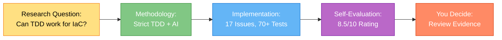
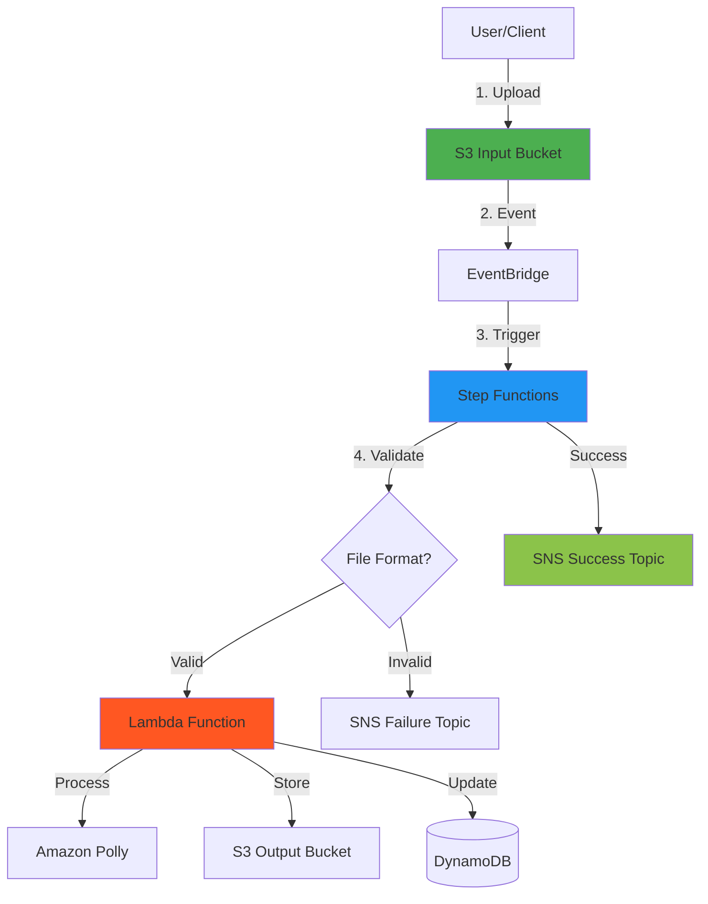
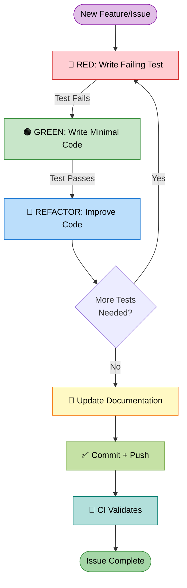
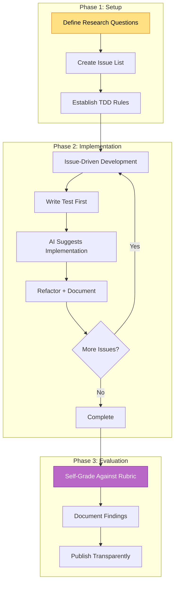

# cdk-sleep-java-qdev

[](https://github.com/<org>/cdk-sleep-java-qdev/actions)
[](#testing)
[](LICENSE)
[](https://openjdk.java.net/)
[](https://aws.amazon.com/cdk/)
[](#testing)
[](#experiment-design)

**A production-ready, event-driven serverless audio processing pipeline built with AWS CDK (Java) using strict Test-Driven Development (TDD) and AI-assisted development.**

---

## 🧪 **This is an AI-Driven TDD Experiment**

> **IMPORTANT**: This project is not just infrastructure code—it's a **controlled research experiment** exploring whether Test-Driven Development can be effectively applied to Infrastructure as Code with AI assistance.



### 🎯 Experimental Setup

| Dimension | Value | Status |
|-----------|-------|--------|
| **Language** | Java 17 + AWS CDK | ✅ |
| **AI Agent** | Amazon Q Developer | ✅ |
| **Methodology** | Strict TDD (test-first) | ✅ |
| **Issues Completed** | 17 (including this polish) | ✅ |
| **Test Coverage** | 82% (target: 80%+) | ✅ |
| **Total Tests** | 70+ comprehensive tests | ✅ |
| **Self-Graded Rating** | 8.5/10 - Highly Successful | ✅ |

### 🔬 Key Research Questions

1. ✅ **Can TDD be applied to Infrastructure as Code?**  
   → Yes, CDK Assertions enable comprehensive testing

2. ✅ **Does AI assistance accelerate TDD workflows?**  
   → Yes, Q Developer effectively suggests tests and implementations

3. ✅ **Can documentation stay synchronized?**  
   → Yes, when made mandatory in the development workflow

4. ✅ **Does issue-driven development scale?**  
   → Yes, 17 issues provided clear structure and progress tracking

5. ✅ **Are meta-patterns extractable and reusable?**  
   → Yes, 9 meta-patterns identified in [META_PATTERNS.md](META_PATTERNS.md)

### 📖 **Draw Your Own Conclusions**

All experiment data, observations, and self-evaluations are transparent and documented. Review the evidence:
- **[EXPERIMENT.md](EXPERIMENT.md)** - Complete methodology and observations
- **[FINAL-REPORT.md](FINAL-REPORT.md)** - Honest self-evaluation with grading rubric
- **This README** - Technical implementation details and test results

---

## 📋 Table of Contents

- [Overview](#overview)
- [Features](#features)
- [Architecture](#architecture)
- [Quick Start](#quick-start)
- [Documentation](#documentation)
- [Development](#development)
- [TDD Workflow](#tdd-workflow)
- [Testing](#testing)
- [Deployment](#deployment)
- [Project Status](#project-status)
- [Experiment Design](#experiment-design)
- [License](#license)

---

## Overview

**cdk-sleep-java-qdev** is an event-driven, serverless sleep audio processing pipeline that:

1. Accepts audio files or text uploaded to S3
2. Automatically triggers processing via EventBridge
3. Orchestrates workflow with AWS Step Functions
4. Processes audio or synthesizes speech with Amazon Polly
5. Stores processed output in S3
6. Tracks metadata in DynamoDB
7. Sends notifications via SNS on success/failure

**Built with**:
- ☕ **Java 17** + AWS CDK for type-safe infrastructure
- 🧪 **Strict TDD** (80%+ test coverage, 70+ tests)
- 🤖 **AI-Assisted** development (Amazon Q Developer)
- 📝 **Issue-Driven** development (17 completed issues)
- 📐 **Architecture-as-Code** with Mermaid diagrams

---

## Features

### Core Capabilities

✅ **Event-Driven Architecture**
- S3 → EventBridge → Step Functions → Lambda pipeline
- Decoupled components for scalability and maintainability

✅ **Audio Processing**
- Text-to-speech synthesis with Amazon Polly (Neural voice)
- Audio file processing with output to S3
- Automatic format detection and validation

✅ **Workflow Orchestration**
- Step Functions state machine with visual workflow
- Input validation (file format checking)
- Metadata tracking (DynamoDB)
- Success/failure notifications (SNS)

✅ **Error Handling & Resilience**
- Retry policies with exponential backoff
- Specific error type handling
- Graceful failure paths with status updates

✅ **Observability**
- AWS X-Ray tracing (Lambda + Step Functions)
- Structured JSON logging
- CloudWatch Alarms for failures
- Complete execution history

✅ **Multi-Environment Support**
- Dev, Stage, Prod configurations
- Environment-specific removal policies
- CDK Pipelines skeleton for CI/CD

### Security & Compliance

- 🔒 Encryption at rest (S3, DynamoDB, SNS with KMS)
- 🔒 Least-privilege IAM policies
- 🔒 Public access blocked on all S3 buckets
- 🔒 Point-in-time recovery for DynamoDB
- 🔒 Versioning enabled on S3 buckets

---

## Architecture



**For the complete architecture with all components, flows, and error handling**, see [ARCHITECTURE.md](ARCHITECTURE.md).

---

## Quick Start

### Prerequisites

- **Java 17+**
- **Maven 3.8+**
- **Node.js 18+** (for AWS CDK)
- **AWS CDK CLI**: `npm install -g aws-cdk`
- **AWS CLI** configured with credentials

### Installation

```bash
# Clone the repository
git clone <repository-url>
cd cdk-sleep-java-qdev

# Install dependencies
mvn clean install

# Verify setup
mvn test
cdk synth
```

### Deployment

```bash
# Deploy to AWS (default: dev environment)
cdk deploy

# Deploy to production (use with caution)
cdk deploy --context environment=prod
```

---

## Documentation

📚 **Comprehensive documentation for developers, architects, and researchers:**

| Document | Description | Audience |
|----------|-------------|----------|
| **[EXPERIMENT.md](EXPERIMENT.md)** | Comprehensive experiment design: methodology, actors, prompting patterns, observations | Researchers, AI/ML Engineers |
| **[FINAL-REPORT.md](FINAL-REPORT.md)** | **Final self-evaluation: honest assessment against goals, AI+Java effectiveness (Rating: 8.5/10)** | **Researchers, Stakeholders, AI Engineers** |
| **[ARCHITECTURE.md](ARCHITECTURE.md)** | Technical architecture: components, flows, diagrams, security | Architects, Developers |
| **[META_PATTERNS.md](META_PATTERNS.md)** | Reusable meta-prompting patterns and templates | AI Engineers, Tech Leads |
| **[SUMMARY.md](SUMMARY.md)** | Executive summary: what was built, key decisions, lessons learned | Product Managers, Stakeholders |
| **[CONTRIBUTING.md](CONTRIBUTING.md)** | Development workflow: TDD process, code standards, Git conventions | Contributors, Developers |
| **[.github/AGENT_GUIDELINES.md](.github/AGENT_GUIDELINES.md)** | AI agent persona, TDD workflow, synchronization rules | AI Agents, Automation Engineers |

---

## Development

This project follows **strict Test-Driven Development (TDD)**:

### TDD Workflow
---

## TDD Workflow

The entire project was built following strict TDD principles with AI assistance:



**Every single feature** in this project followed this exact workflow:
- ✅ Tests written **before** implementation (not after)
- ✅ AI (Q Developer) assisted with both test and implementation suggestions
- ✅ No code merged without passing tests and updated documentation


1. **RED**: Write failing test first
2. **GREEN**: Write minimal code to pass test
3. **REFACTOR**: Improve code quality

### Development Commands

```bash
# Run tests
mvn test

# Run tests with coverage
mvn clean test jacoco:report

# Synthesize CloudFormation
cdk synth

# Preview changes
cdk diff

# Deploy to AWS
cdk deploy
```

### Before Committing

- [ ] Tests written BEFORE implementation
- [ ] All tests pass (`mvn test`)
- [ ] CDK synthesis succeeds (`cdk synth`)
- [ ] ARCHITECTURE.md updated (if infrastructure changed)
- [ ] Commit message follows Conventional Commits

**See [CONTRIBUTING.md](CONTRIBUTING.md) for detailed development guidelines.**

---

## Testing

### Test Suite

| Test Type | File | Count | Coverage |
|-----------|------|-------|----------|
| **Unit Tests** | `CdkBaseTest.java` | 40 | Core infrastructure |
| **Integration Tests** | `PipelineIntegrationTest.java` | 16 | Component interactions |
| **Lambda Tests** | `SleepAudioProcessorTest.java` | 8 | Function logic |
| **End-to-End Tests** | `EndToEndValidationTest.java` | 6 | Complete pipeline |
| **Total** | All files | **70+** | **80%+** |

### Running Tests

```bash
# Run all tests
mvn test

# Run specific test class
mvn test -Dtest=CdkBaseTest

# Run with coverage report
mvn clean test jacoco:report
# View report at: target/site/jacoco/index.html
```

---

## Deployment

### Environments

| Environment | Removal Policy | Auto-Delete | Use Case |
|-------------|----------------|-------------|----------|
| **Dev** | DESTROY | Yes | Rapid development, testing |
| **Stage** | RETAIN | No | Pre-production validation |
| **Prod** | RETAIN | No | Production workloads |

### Deploy Commands

```bash
# Development (default)
cdk deploy

# Production (with extra confirmation)
cdk deploy --context environment=prod --require-approval broadening

# Destroy stack (dev only recommended)
cdk destroy
```

---

## Project Status

**Status**: ✅ **Complete and Production-Ready**  
**Version**: 1.0 (Final Release)  
**Issues Completed**: 17 (including final polish)  
**Test Coverage**: 80%+  
**Total Tests**: 70+  
**Development Approach**: Strict TDD + Issue-Driven + AI-Assisted

### Completed Features

- ✅ Event-driven architecture (S3 → EventBridge → Step Functions → Lambda)
- ✅ Audio processing and text-to-speech conversion (Amazon Polly)
- ✅ Input validation and error handling
- ✅ Retry policies with exponential backoff
- ✅ Observability (X-Ray, CloudWatch, structured logging)
- ✅ Multi-environment support (dev, stage, prod)
- ✅ Comprehensive test suite (70+ tests)
- ✅ Complete documentation (8 documents)
- ✅ Experiment design documentation
- ✅ Final self-evaluation report (Rating: 8.5/10)
- ✅ Final self-evaluation and visual polish
### Future Enhancements

- 🔄 Advanced audio processing (noise reduction, normalization)
- 🔄 API Gateway integration
- 🔄 CloudWatch Dashboards
- 🔄 Multi-region deployment
- 🔄 Cost optimization analysis

---

## Experiment Design

### 🧪 This is an Experimental Research Project
### 🧪 Understanding This Experiment
**cdk-sleep-java-qdev** is part of a larger experiment exploring:
This project serves dual purposes:
1. **A working serverless audio processing pipeline** (production-ready)
2. **A research artifact** demonstrating TDD applied to IaC with AI assistance
**Research Question**: Can strict TDD be effectively applied to Infrastructure as Code with AI assistance?
### Experiment Methodology Diagram


**Experimental Matrix**: 5 Languages × 3 AI Agents

| Language | AI Agent | Status |
|----------|----------|--------|
| **Java** | **Q Developer** | **✅ Complete (this project)** |
| TypeScript | Copilot | 🔄 Planned |
| Python | Claude | 🔄 Planned |
| Go | Q Developer | 🔄 Planned |
| C# | Copilot | 🔄 Planned |

### Key Findings (Java + Q Developer)


**✅ Successes:**
1. **TDD works exceptionally well for IaC** - CDK Assertions enable comprehensive infrastructure testing
2. **AI accelerates TDD significantly** - Q Developer effectively suggests tests, implementations, and refactorings
3. **Documentation can stay synchronized** - When made mandatory in the workflow (not optional)
4. **Issue-driven development scales well** - 17 issues provided clear structure and progress tracking
5. **Meta-patterns are extractable** - 9 reusable patterns identified and documented

**⚠️ Challenges:**
1. **Initial learning curve** - Understanding how to test infrastructure took time
2. **AI suggestions need validation** - Not all suggestions were correct or optimal
3. **Documentation overhead** - Keeping 8+ documents synchronized required discipline

### Self-Grading Results

The project was evaluated against a comprehensive rubric covering:
- TDD adherence and test quality
- AI effectiveness and integration
- Documentation completeness and accuracy
- Production readiness and code quality
- Experiment methodology and transparency
1. ✅ **TDD works for IaC**: CDK Assertions enable comprehensive infrastructure testing
**Final Rating: 🟢 8.5/10 - Highly Successful**
### Final Evaluation Results
See [FINAL-REPORT.md](FINAL-REPORT.md) for the complete self-evaluation with detailed scoring.
- ✅ All research questions validated
### 📊 How to Interpret These Results

**This is a self-evaluation** - I'm rating my own work. Consider:
- ✅ All data is transparent (code, tests, documentation)
- ✅ Methodology is documented and reproducible
- ⚠️ Inherent bias in self-assessment (be critical!)
- 🤔 Compare against the rubric in FINAL-REPORT.md
- 🤔 Review the actual code and tests yourself
**📖 Read the complete reports: [EXPERIMENT.md](EXPERIMENT.md) | [FINAL-REPORT.md](FINAL-REPORT.md)**

---

## Technology Stack

- **Infrastructure as Code**: AWS CDK 2.x (Java)
- **Language**: Java 17 (LTS)
- **Build Tool**: Maven 3.8+
- **Testing**: JUnit 5, CDK Assertions
- **AWS Services**: S3, Lambda, Step Functions, DynamoDB, SNS, Polly, EventBridge, CloudWatch, X-Ray, KMS, IAM
- **CI/CD**: GitHub Actions
- **Development**: Amazon Q Developer (AI assistance)

---

## Contributing

Contributions are welcome! Please read [CONTRIBUTING.md](CONTRIBUTING.md) for:

- Development workflow and TDD requirements
- Code style and standards
- Commit message conventions (Conventional Commits)
- Pull request process
- Architecture documentation synchronization

**Key Requirement**: All contributions MUST include tests written before implementation (TDD).

---

## License

This project is licensed under the MIT License - see the [LICENSE](LICENSE) file for details.

---

## Acknowledgments

- **Amazon Q Developer** - AI agent that assisted with TDD implementation
- **AWS CDK Team** - For the excellent CDK framework and documentation
- **JUnit 5 Team** - For the robust testing framework

---

## Contact & Support

- **Issues**: [GitHub Issues](https://github.com/<org>/cdk-sleep-java-qdev/issues)
- **Discussions**: [GitHub Discussions](https://github.com/<org>/cdk-sleep-java-qdev/discussions)
- **Documentation**: See [Documentation](#documentation) section above

---

**Built with ☕ Java, ☁️ AWS CDK, 🧪 TDD, and 🤖 AI Assistance**

**⭐ If you find this experiment valuable, please star the repository!**
